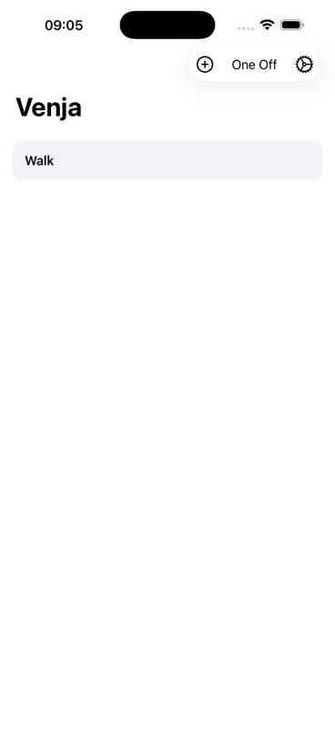
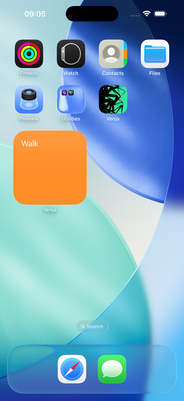
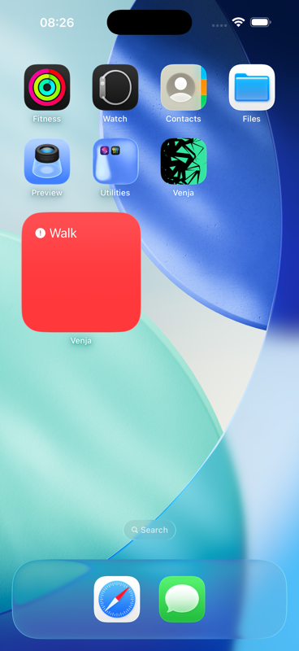

# Venja

[Download on the iOS App Store](https://apps.apple.com/se/app/venja/id6747004428)

Venja is an app to help you keep track of chores that should be done, habits that you're trying to keep up with, and maintenance for your house, car, etc. It's based on a scheduler, and the idea is to keep track of things that you need to do every day all the way up to every few years.

## Screenshots

  
  
  
  

